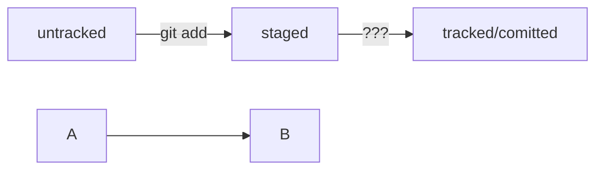

# Мои заметки по Git/GitHub

## Соглашения о коммитах
(Соглашения о коммитах)[https://www.conventionalcommits.org/en/v1.0.0/]

## Статусы файлов в Git (mermaid-схема)



## Код

```python
print('Hello world from Python!')
```

```bash
echo "Hello world from bash!"
```
