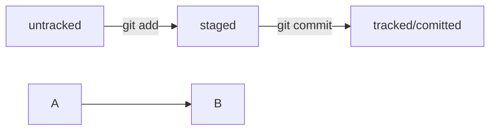

# Мои заметки по Git/GitHub

## Соглашения о коммитах
[Соглашения о коммитах](https://www.conventionalcommits.org/en/v1.0.0/)

## Статусы файлов в Git (mermaid-схема)



## Код

```python
print('Hello world from Python!')
```

```bash
echo "Hello world from bash!"
```

git init

git remote add origin https://github.com/YandexPracticum/first-project.git

git remote -v

git push -u origin main

git push

git add todo.txt

git add --all, git add .

git commit -m "Комментарий к коммиту."

git log

git log --oneline

git status

git commit --amend --no-edit

git commit --amend -m "Новое сообщение"

git restore --staged hello.txt

git restore hello.txt

git reset --hard b576d89

git diff

git diff a9928ab 11bada1

git diff --staged

